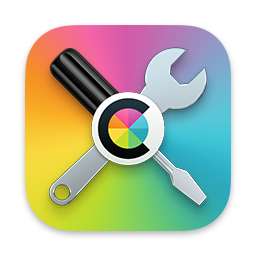
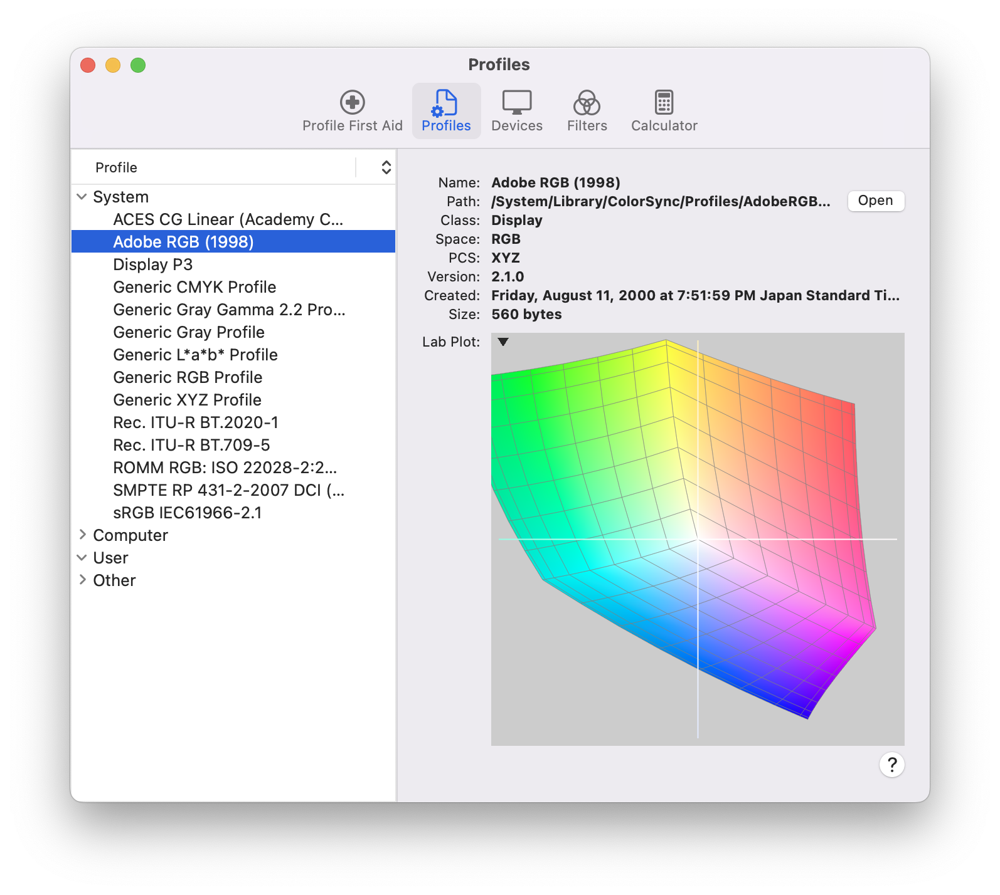

## Introduction

Experiments and utility functions for ICC profile v4.4.

## Color Space in 5 Sentences

The concept of color space is the representation of the visible spectrum using variables. Due to the nature of light as electromagneric wave related by `c = fλ` and wave interference, it is possible to represent the entire visible spectrum reasonably accurate using only a small number of colors. In reality, the retina of human eyes are more sensitive to some colors (red, green and blue) and many displays use LEDs that emit red, green and blue light. Historically RGB became one of the most prevalent color model for color space, but other color formats such as CMYK, HSL and YCbCr are also common. For software engineers, the choice of a color model for color space should consider the data size, resolution, gamut and accuracy, the relevant input device, output device or media, among many other factors.

## Profile Header

| field               | size (in bytes) | completed |
|---------------------|-----------------|-----------|
| size                | 4               | ❌        |
| CMM1     | 4               | ✅︎        |
| version             | 4               | ✅︎        |
| deviceClass         | 4               | ✅︎        |
| color space         | 4               | ✅︎        |
| PCS2     | 4               | ✅︎        |
| datetime            | 12              | ✅︎        |
| profile signature   | 4               | ✅︎        |
| platform            | 4               | ✅︎        |
| CMM flags           | 4               | ✅︎        |
| manufacturer        | 4               | ✅︎        |
| device model        | 4               | ❌        |
| device attributes   | 8               | ✅︎        |
| rendering intent    | 4               | ✅︎        |
| nCIEXYZ3 | 12              | ❌        |
| creator             | 4               | ✅︎        |
| profile id          | 16              | ❌        |
| reserved            | 28              | ✅︎        |

1 Color Management Module

2 Profile Connection Space

3 (to be updated)

## Apple ColorSync Utility

For Mac, the official application ColorSync Utility can registers different color profiles and transforms color between different color model.

## Specification

[Specification ICC.1:2022 (Profile version 4.4.0.0)](https://www.color.org/specification/ICC.1-2022-05.pdf)

[Private and ICC tag and CMM registry](https://www.color.org/signatures2.xalter)

[Manufacturer Registry](https://www.color.org/signatureRegistry/index.xalter)

## Documentation

[International Color Consortium](https://www.color.org/)

[ColorSync Utility | Apple](https://support.apple.com/guide/colorsync-utility/welcome/mac)

[Color profiles | Adobe](https://helpx.adobe.com/acrobat/using/color-profiles.html)

## Bugs Known

These are bugs or discrepancies I discovered when I am developing the software.

1. In the official Private and ICC Tag and CMM Registry dated 4 March 2021, the CMM Signature for Konica Minolta is listed as "MCML" with ASCII of 0x4D43_4D44, but the ASCII value of "L" is 0x4C, the correct signature for "MCML" should be 0x4D43_4D4C. For backward compatibility, both values are decoded to "Konica Minolta".
